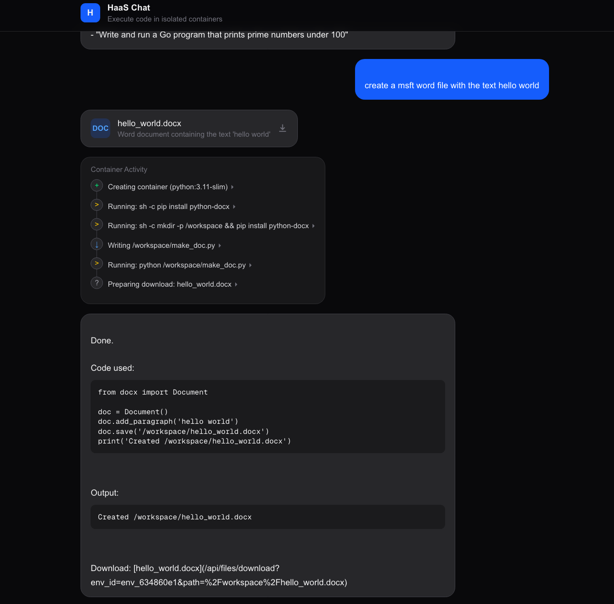
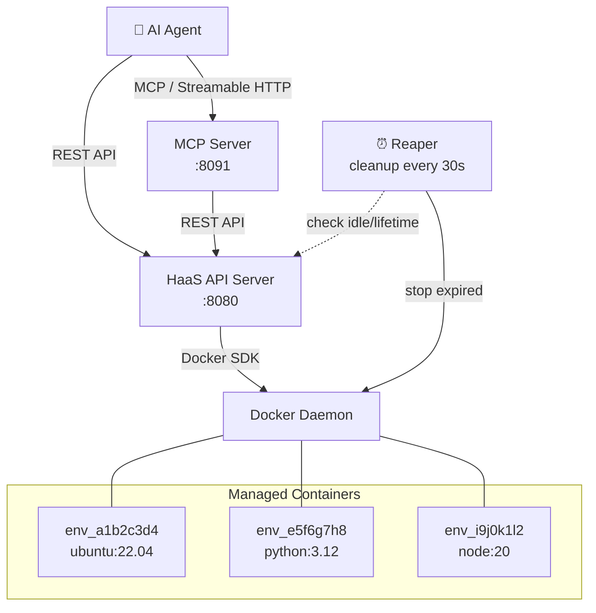
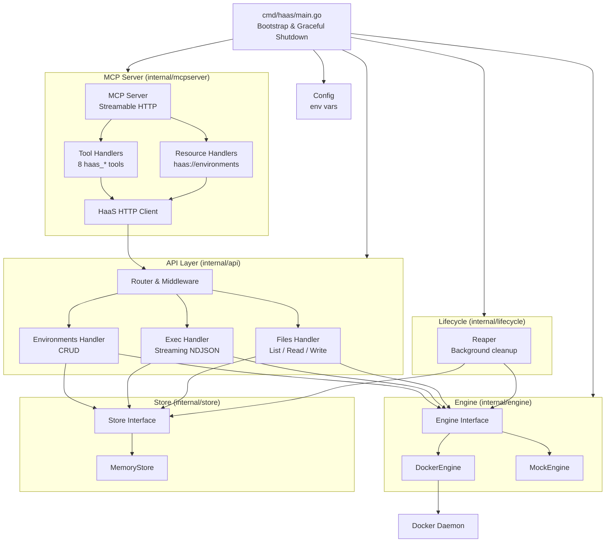
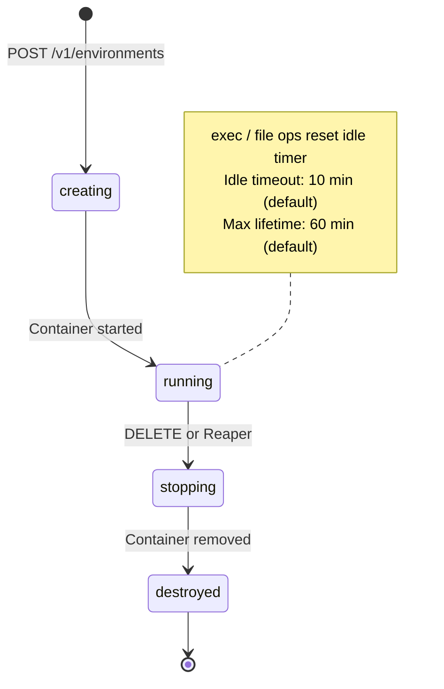
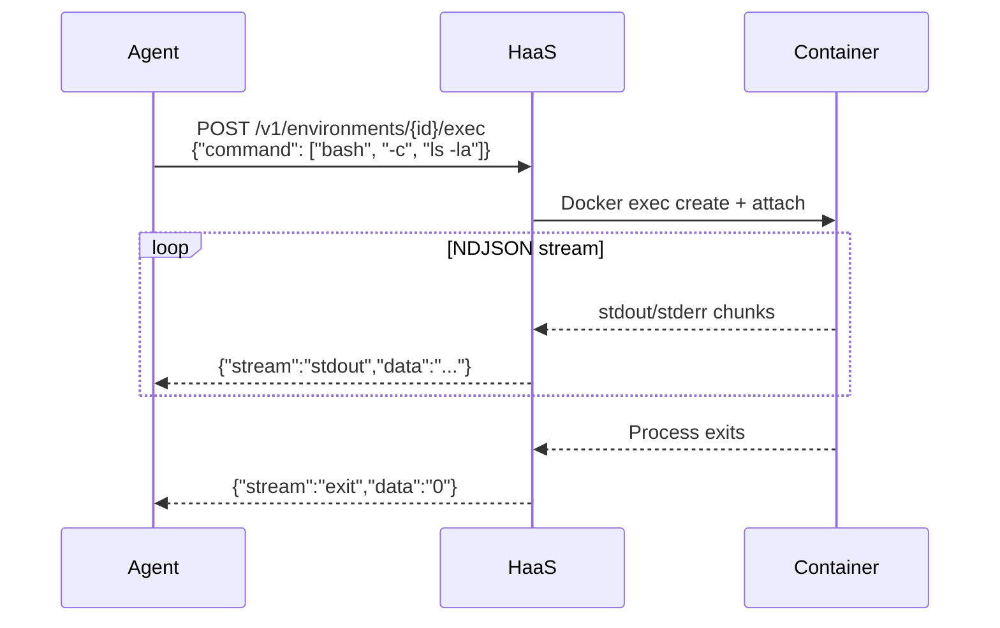

# HaaS — Harness as a Service

**HaaS** is an environment harness service for AI agents. It provides a REST API and an MCP server to spin up isolated Docker containers on-demand, giving agents a full machine to work with — complete with shell access, file management, and automatic lifecycle cleanup.

The premise is simple: **AI agents work better when they have a real environment to operate in.** Instead of sandboxed snippets or simulated shells, HaaS gives each agent its own container with a real filesystem, real networking, and real command execution — then cleans it up when the agent is done.

Example usage:


---

## Architecture

### System Overview



### Internal Architecture



### Container Lifecycle



### Exec Streaming



---

## Quick Start

### Prerequisites

- **Go 1.22+**
- **Docker** running locally

### Build & Run

```bash
# Build REST server
make build

# Build MCP standalone binary
make build-mcp

# Run (starts both REST API on :8080 and MCP server on :8091)
make run
```

### Authentication

HaaS requires an API key before starting. Add it to a `.env` file in the project root:

```bash
HAAS_API_KEYS=your-secret-key
```

Multiple keys are supported (comma-separated):

```bash
HAAS_API_KEYS=key-for-agent-1,key-for-agent-2
```

The same keys are used to authenticate both the REST API and the MCP server.

### Verify

```bash
# REST API
curl http://localhost:8080/healthz
# {"status":"ok"}

# MCP server
curl -X POST http://localhost:8091/ \
  -H "Content-Type: application/json" \
  -H "Authorization: Bearer your-secret-key" \
  -d '{"jsonrpc":"2.0","id":1,"method":"tools/list","params":{}}'
```

---

## Connecting Agents

HaaS supports two integration paths. Clients can use either or both.

### Option 1 — REST API

Direct HTTP calls. Use this when you control the backend and want to implement your own tool execution loop with the Anthropic SDK.

All requests to `/v1/environments` require a Bearer token:

```bash
curl -H "Authorization: Bearer your-secret-key" http://localhost:8080/v1/environments
```

See the [API Reference](#api-reference) below.

### Option 2 — MCP Server

The MCP server starts automatically alongside the REST API on `:8091`. It exposes all HaaS operations as MCP tools that AI models can call natively.

**Tools exposed:**

| Tool | Description |
|---|---|
| `haas_create_environment` | Spin up a new container |
| `haas_list_environments` | List active environments |
| `haas_get_environment` | Get environment details |
| `haas_destroy_environment` | Destroy an environment |
| `haas_exec` | Run a command, returns stdout/stderr/exit code |
| `haas_list_files` | List files at a path |
| `haas_read_file` | Read a file |
| `haas_write_file` | Write a file |

**Resources exposed:**

| URI | Description |
|---|---|
| `haas://environments` | Live list of all active environments |
| `haas://environments/{id}` | Details of a specific environment |

#### Connect via VS Code

Add to `.vscode/mcp.json`:

```json
{
  "servers": {
    "Haas": {
      "url": "http://localhost:8091",
      "type": "http",
      "headers": {
        "Authorization": "Bearer your-secret-key"
      }
    }
  }
}
```

#### Connect via Claude Desktop (stdio)

Build the standalone binary and configure Claude Desktop:

```bash
make build-mcp
```

Add to `~/Library/Application Support/Claude/claude_desktop_config.json`:

```json
{
  "mcpServers": {
    "haas": {
      "command": "/absolute/path/to/haas/bin/haas-mcp",
      "env": {
        "HAAS_URL": "http://localhost:8080",
        "HAAS_API_KEY": "your-secret-key"
      }
    }
  }
}
```

#### Connect via Anthropic SDK (remote/ngrok)

Expose the MCP server publicly (e.g. via ngrok), then pass it directly to the Anthropic SDK:

```bash
# Terminal 1
ngrok http 8091

# Terminal 2 — start HaaS
make run
```

```typescript
const response = await anthropic.beta.messages.create({
  model: "claude-sonnet-4-6",
  max_tokens: 8096,
  tools: [{
    type: "mcp",
    server_label: "haas",
    server_url: "https://your-ngrok-url",
  }],
  messages: [{ role: "user", content: userMessage }],
  betas: ["mcp-client-2025-04-04"],
});
```

---

## API Reference

| Method | Path | Description |
|--------|------|-------------|
| `GET` | `/healthz` | Health check (no auth required) |
| `POST` | `/v1/environments` | Create a new environment |
| `GET` | `/v1/environments` | List all environments |
| `GET` | `/v1/environments/{id}` | Get environment details |
| `DELETE` | `/v1/environments/{id}` | Destroy an environment |
| `POST` | `/v1/environments/{id}/exec` | Execute a command (NDJSON stream) |
| `GET` | `/v1/environments/{id}/files?path=` | List files at path |
| `GET` | `/v1/environments/{id}/files/content?path=` | Download a file |
| `PUT` | `/v1/environments/{id}/files/content?path=` | Upload a file |

### Create an Environment

```bash
curl -X POST http://localhost:8080/v1/environments \
  -H "Authorization: Bearer your-secret-key" \
  -H "Content-Type: application/json" \
  -d '{
    "image": "ubuntu:22.04",
    "cpu": 1.0,
    "memory_mb": 2048,
    "network_policy": "full"
  }'
```

Response:
```json
{
  "id": "env_a1b2c3d4",
  "status": "running",
  "image": "ubuntu:22.04"
}
```

### Execute a Command

```bash
curl -X POST http://localhost:8080/v1/environments/env_a1b2c3d4/exec \
  -H "Authorization: Bearer your-secret-key" \
  -H "Content-Type: application/json" \
  -d '{"command": ["bash", "-c", "echo hello world"], "timeout_seconds": 30}'
```

Response (NDJSON stream):
```
{"stream":"stdout","data":"hello world\n"}
{"stream":"exit","data":"0"}
```

---

## Configuration

| Variable | Default | Description |
|---|---|---|
| `HAAS_API_KEYS` | (required) | Comma-separated list of valid API keys |
| `HAAS_LISTEN_ADDR` | `:8080` | REST API bind address |
| `DOCKER_HOST` | (auto) | Docker daemon socket |
| `HAAS_DEFAULT_CPU` | `1.0` | Default CPU cores per container |
| `HAAS_DEFAULT_MEMORY_MB` | `2048` | Default memory (MB) |
| `HAAS_DEFAULT_DISK_MB` | `4096` | Default disk (MB) |
| `HAAS_IDLE_TIMEOUT` | `10m` | Idle time before reaping |
| `HAAS_MAX_LIFETIME` | `60m` | Maximum container lifetime |
| `HAAS_DEFAULT_NETWORK_POLICY` | `none` | Default network policy |
| `HAAS_MAX_FILE_UPLOAD_MB` | `100` | Max file upload size (MB) |
| `HAAS_MCP_LISTEN_ADDR` | `:8091` | MCP server bind address |
| `HAAS_MCP_REST_URL` | (derived) | URL the MCP server uses to call the REST API — override for containerised deployments |

---

## Security

Every container is hardened:

- **No privileged mode** — containers run unprivileged
- **All capabilities dropped** — only `NET_BIND_SERVICE` added when networking is enabled
- **`no-new-privileges`** — prevents privilege escalation
- **PID limit: 256** — prevents fork bombs
- **Memory hard limit** — no swap, enforced ceiling
- **CPU limit** — capped cores via NanoCPUs
- **Network isolation** — `none`, `egress-limited`, or `full`

The MCP server requires the same Bearer token as the REST API. Requests without a valid `Authorization: Bearer <key>` header are rejected with 401.

---

## Network Policies

| Policy | Behavior |
|--------|----------|
| `none` | Complete network isolation — no inbound or outbound |
| `egress-limited` | Bridge networking (MVP — production would use iptables rules) |
| `full` | Full bridge networking — unrestricted access |

---

## Development

```bash
make build             # Build REST server binary → bin/haas
make build-mcp         # Build standalone MCP binary → bin/haas-mcp
make run               # Run REST + MCP servers
make run-mcp           # Run standalone MCP binary (stdio)
make test              # Run unit tests
make test-integration  # Run integration tests (requires Docker)
make lint              # Run golangci-lint
make clean             # Remove build artifacts
make deps              # Tidy go modules
```

---

## Project Structure

```
haas/
├── cmd/
│   ├── haas/main.go          # REST API + embedded MCP server entry point
│   └── haas-mcp/main.go      # Standalone MCP server (stdio / SSE / HTTP)
├── internal/
│   ├── api/                  # HTTP handlers & middleware
│   ├── config/               # Environment-variable config
│   ├── domain/               # Core types (Environment, ExecRequest, etc.)
│   ├── engine/               # Container runtime abstraction (Docker)
│   ├── lifecycle/            # Reaper — automatic container cleanup
│   ├── mcpserver/            # MCP server (tools, resources, auth, transports)
│   └── store/                # State persistence (in-memory)
├── pkg/apitypes/             # Public request/response types for SDKs
└── test/                     # Integration tests & test utilities
```

---

## Roadmap

- [ ] **Go SDK** — Client library in `pkg/sdk/` using the types already defined in `pkg/apitypes`
- [ ] **Python SDK** — For Python-based agent frameworks (LangChain, CrewAI, etc.)
- [ ] **TypeScript SDK** — For JS/TS agent frameworks
- [x] **MCP Server** — [Model Context Protocol](https://modelcontextprotocol.io/) server so agents can use HaaS tools natively
- [ ] **Persistent storage** — Swap `MemoryStore` for a database-backed implementation
- [ ] **Image allowlist** — Restrict which Docker images can be used
- [x] **Auth & API keys** — Bearer token authentication via `HAAS_API_KEYS`
- [ ] **Egress firewall** — Proper iptables rules for `egress-limited` network policy
- [ ] **WebSocket exec** — Interactive terminal sessions over WebSocket
- [ ] **Container snapshots** — Save and restore environment state

---

## License

MIT License.

Made with ❤️ and Claude by Danilo.
