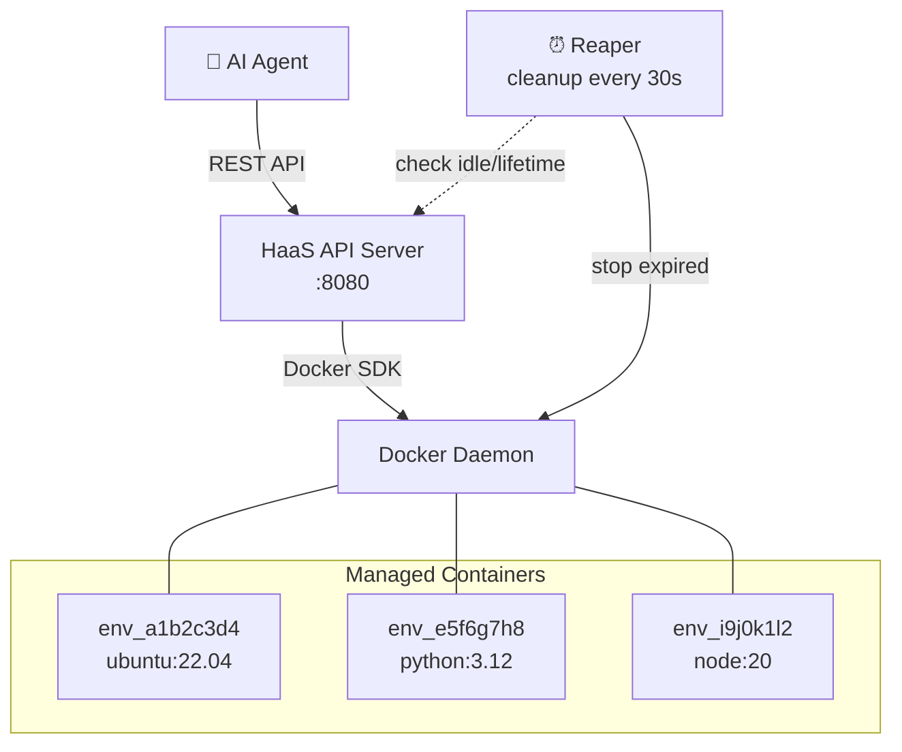
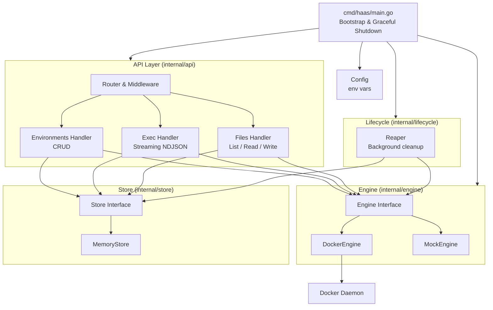
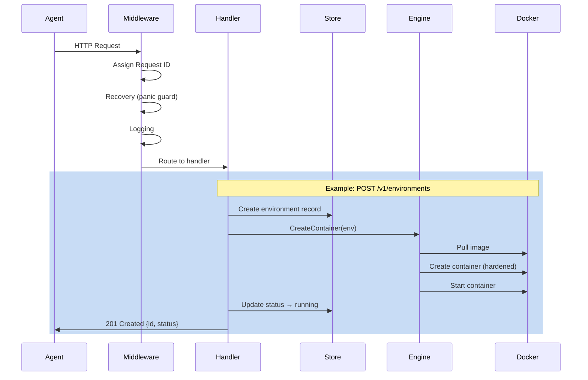
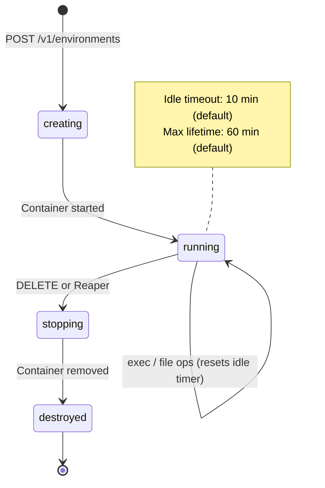
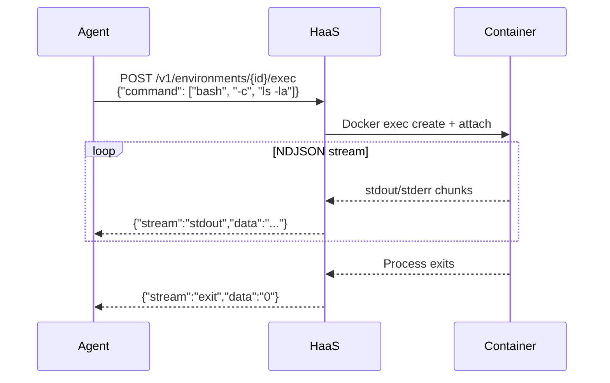

# HaaS — Harness as a Service

**HaaS** is an environment harness service for AI agents. It provides a REST API to spin up isolated Docker containers on-demand, giving agents a full machine to work with — complete with shell access, file management, and automatic lifecycle cleanup.

The premise is simple: **AI agents work better when they have a real environment to operate in.** Instead of sandboxed snippets or simulated shells, HaaS gives each agent its own container with a real filesystem, real networking, and real command execution — then cleans it up when the agent is done.

Example usage:


---

## Architecture

### System Overview



### Internal Architecture



### Request Flow



### Container Lifecycle



### Exec Streaming



---

## Quick Start

### Prerequisites

- **Go 1.22+**
- **Docker** running locally

### Build & Run

```bash
# Build
make build

# Run (Docker must be running)
make run

# Or directly
go run ./cmd/haas
```

The server starts on `:8080` by default.

### Verify

```bash
curl http://localhost:8080/healthz
# {"status":"ok"}
```

---

## API Usage

### Create an Environment

```bash
curl -X POST http://localhost:8080/v1/environments \
  -H "Content-Type: application/json" \
  -d '{
    "image": "ubuntu:22.04",
    "cpu": 1.0,
    "memory_mb": 2048,
    "network_policy": "full"
  }'
```

Response:
```json
{
  "id": "env_a1b2c3d4",
  "status": "running",
  "image": "ubuntu:22.04"
}
```

### Execute a Command

```bash
curl -X POST http://localhost:8080/v1/environments/env_a1b2c3d4/exec \
  -H "Content-Type: application/json" \
  -d '{
    "command": ["bash", "-c", "echo hello world && ls /"],
    "timeout_seconds": 30
  }'
```

Response (NDJSON stream):
```
{"stream":"stdout","data":"hello world\n"}
{"stream":"stdout","data":"bin\nboot\ndev\netc\nhome\n..."}
{"stream":"exit","data":"0"}
```

### List Files

```bash
curl http://localhost:8080/v1/environments/env_a1b2c3d4/files?path=/home
```

### Read a File

```bash
curl http://localhost:8080/v1/environments/env_a1b2c3d4/files/content?path=/etc/hostname
```

### Write a File

```bash
curl -X PUT http://localhost:8080/v1/environments/env_a1b2c3d4/files/content?path=/tmp/hello.txt \
  --data-binary "Hello from the agent!"
```

### Destroy an Environment

```bash
curl -X DELETE http://localhost:8080/v1/environments/env_a1b2c3d4
# 204 No Content
```

---

## API Reference

| Method | Path | Description |
|--------|------|-------------|
| `GET` | `/healthz` | Health check |
| `POST` | `/v1/environments` | Create a new environment |
| `GET` | `/v1/environments` | List all environments |
| `GET` | `/v1/environments/{id}` | Get environment details |
| `DELETE` | `/v1/environments/{id}` | Destroy an environment |
| `POST` | `/v1/environments/{id}/exec` | Execute a command (streaming) |
| `GET` | `/v1/environments/{id}/files?path=` | List files at path |
| `GET` | `/v1/environments/{id}/files/content?path=` | Download a file |
| `PUT` | `/v1/environments/{id}/files/content?path=` | Upload a file |

---

## Giving Tools to an Agent

HaaS is designed to be the backend for agent tool-use. Here are the tools you should expose to an AI agent, mapped to HaaS endpoints:

### Recommended Tool Set

| Tool Name | HaaS Endpoint | What It Does |
|-----------|---------------|--------------|
| `create_environment` | `POST /v1/environments` | Spin up a fresh machine with a chosen image |
| `run_command` | `POST /v1/environments/{id}/exec` | Run any shell command and stream output |
| `list_files` | `GET /v1/environments/{id}/files` | Browse the filesystem |
| `read_file` | `GET /v1/environments/{id}/files/content` | Read file contents |
| `write_file` | `PUT /v1/environments/{id}/files/content` | Create or overwrite a file |
| `destroy_environment` | `DELETE /v1/environments/{id}` | Clean up when done |

### Example: Agent Tool Definition

```json
{
  "name": "run_command",
  "description": "Execute a shell command in the agent's environment. Returns stdout, stderr, and exit code as a stream.",
  "parameters": {
    "environment_id": "The environment to run in",
    "command": "Shell command to execute (e.g. 'pip install requests && python main.py')",
    "timeout_seconds": "Max execution time (optional, default: no limit)"
  }
}
```

### Typical Agent Workflow

1. **`create_environment`** — Agent requests an `ubuntu:22.04` (or `python:3.12`, `node:20`, etc.) container
2. **`write_file`** — Agent writes code, configs, or data files
3. **`run_command`** — Agent installs dependencies, runs code, inspects output
4. **`read_file`** — Agent reads generated output, logs, or results
5. **Iterate** — Agent continues running commands and editing files until the task is done
6. **`destroy_environment`** — Agent (or the reaper) cleans up

The idle timeout ensures containers are cleaned up even if an agent forgets or crashes.

---

## Configuration

All settings are configured via environment variables:

| Variable | Default | Description |
|---|---|---|
| `HAAS_LISTEN_ADDR` | `:8080` | Server bind address |
| `DOCKER_HOST` | (auto) | Docker daemon socket |
| `HAAS_DEFAULT_CPU` | `1.0` | Default CPU cores per container |
| `HAAS_DEFAULT_MEMORY_MB` | `2048` | Default memory (MB) |
| `HAAS_DEFAULT_DISK_MB` | `4096` | Default disk (MB) |
| `HAAS_IDLE_TIMEOUT` | `10m` | Idle time before reaping |
| `HAAS_MAX_LIFETIME` | `60m` | Maximum container lifetime |
| `HAAS_DEFAULT_NETWORK_POLICY` | `none` | Default network policy |
| `HAAS_MAX_FILE_UPLOAD_MB` | `100` | Max file upload size (MB) |

---

## Security

Every container is hardened:

- **No privileged mode** — containers run unprivileged
- **All capabilities dropped** — only `NET_BIND_SERVICE` added when networking is enabled
- **`no-new-privileges`** — prevents privilege escalation
- **PID limit: 256** — prevents fork bombs
- **Memory hard limit** — no swap, enforced ceiling
- **CPU limit** — capped cores via NanoCPUs
- **Network isolation** — `none`, `egress-limited`, or `full`

---

## Network Policies

| Policy | Behavior |
|--------|----------|
| `none` | Complete network isolation — no inbound or outbound |
| `egress-limited` | Bridge networking (MVP — production would use iptables rules) |
| `full` | Full bridge networking — unrestricted access |

---

## Development

```bash
make build          # Build binary to bin/haas
make run            # Run with go run
make test           # Run unit tests
make test-integration  # Run integration tests (requires Docker)
make lint           # Run golangci-lint
make clean          # Remove build artifacts
make deps           # Tidy go modules
```

---

## Project Structure

```
haas/
├── cmd/haas/main.go           # Entry point
├── internal/
│   ├── api/                   # HTTP handlers & middleware
│   ├── config/                # Environment-variable config
│   ├── domain/                # Core types (Environment, ExecRequest, etc.)
│   ├── engine/                # Container runtime abstraction (Docker)
│   ├── lifecycle/             # Reaper — automatic container cleanup
│   └── store/                 # State persistence (in-memory)
├── pkg/apitypes/              # Public request/response types for SDKs
└── test/                      # Integration tests & test utilities
```

---

## Roadmap

- [ ] **Go SDK** — Client library in `pkg/sdk/` using the types already defined in `pkg/apitypes`
- [ ] **Python SDK** — For Python-based agent frameworks (LangChain, CrewAI, etc.)
- [ ] **TypeScript SDK** — For JS/TS agent frameworks
- [ ] **MCP Server** — [Model Context Protocol](https://modelcontextprotocol.io/) server so agents can use HaaS tools natively
- [ ] **Persistent storage** — Swap `MemoryStore` for a database-backed implementation
- [ ] **Image allowlist** — Restrict which Docker images can be used
- [ ] **Auth & API keys** — Secure multi-tenant access
- [ ] **Egress firewall** — Proper iptables rules for `egress-limited` network policy
- [ ] **WebSocket exec** — Interactive terminal sessions over WebSocket
- [ ] **Container snapshots** — Save and restore environment state

---

## License

MIT License.

Made with ❤️ and Claude by Danilo.